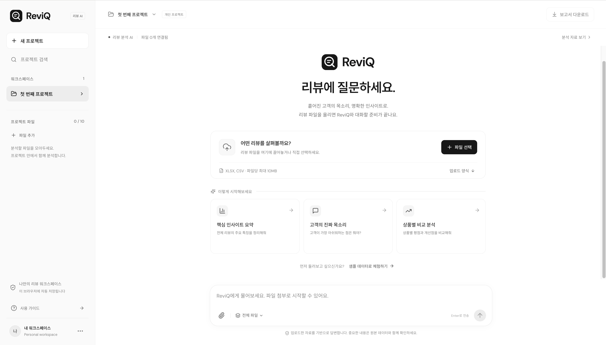
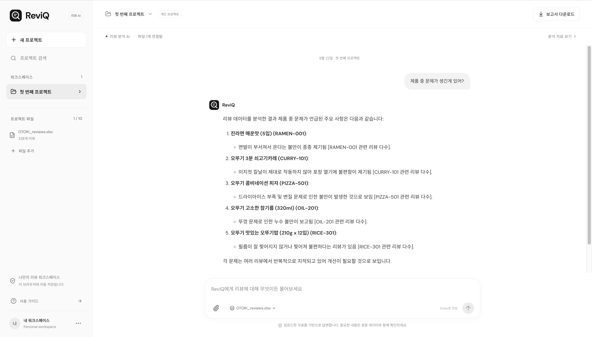
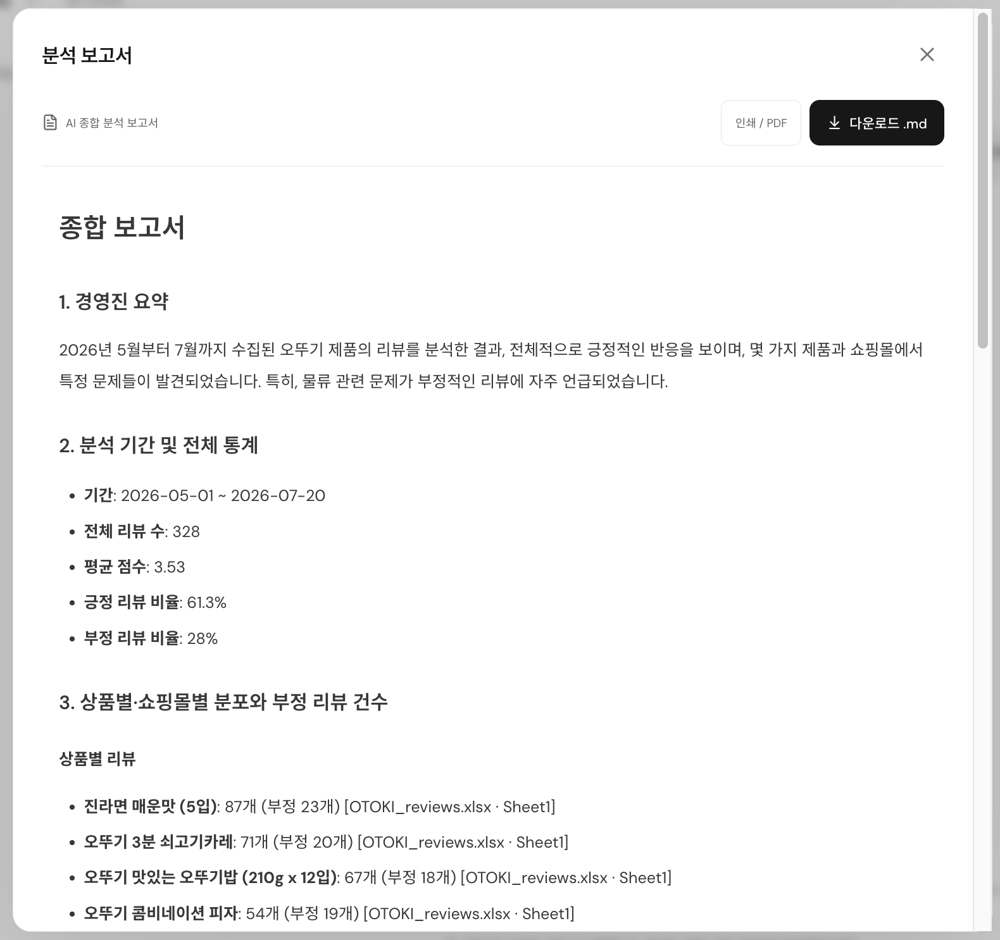
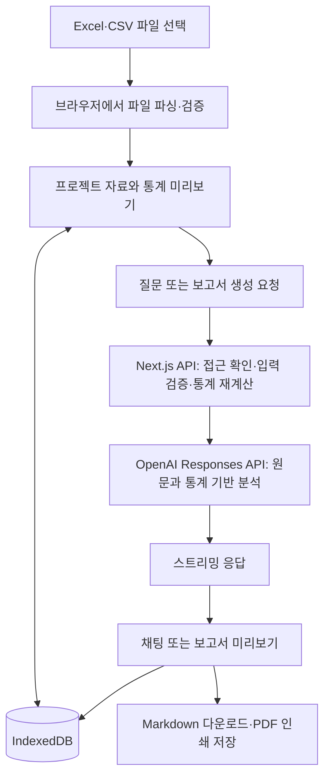
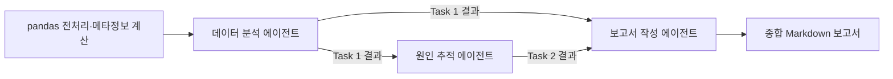

<p align="center">
  
</p>

<h1 align="center">ReviQ</h1>

<p align="center">
  <strong>[AI 에이전트] 리뷰 데이터 기반 분석·채팅·보고서 자동화 서비스</strong><br />
  흩어진 고객의 목소리를 모아, 실행 가능한 인사이트로 연결합니다.
</p>

<p align="center">
  <a href="#서비스-화면">서비스 화면</a> ·
  <a href="#주요-기능">주요 기능</a> ·
  <a href="#시스템-구조">시스템 구조</a> ·
  <a href="#시작하기">시작하기</a> ·
  <a href="#vercel-배포">Vercel 배포</a>
</p>

## 프로젝트 소개

**ReviQ**는 제조·유통 기업이 보유한 고객 리뷰를 분석해 품질 이슈와 개선 방향을 파악하도록 돕는 B2B AI 서비스입니다. 여러 쇼핑몰의 Excel·CSV 파일을 프로젝트에 모으고, 데이터에 대해 질문하거나 종합 분석 보고서를 생성할 수 있습니다.

리뷰 건수와 별점 분포, 상품·채널·일자별 통계는 코드로 계산합니다. AI는 계산된 통계와 리뷰 원문을 함께 읽어 고객 의견을 정리하고, 품질·물류·제품·CS 관점의 후속 조치를 제안합니다.

이 프로젝트는 초기 **Catchy** 기획과 Python CrewAI 프로토타입에서 출발했습니다. 현재 저장소는 이를 **ReviQ 웹 워크스페이스**로 확장한 버전이며, 초기 멀티 에이전트 설계와 현재 웹 실행 구조는 아래에서 구분해 설명합니다.

## 기획 배경

제조사의 리뷰는 자사몰과 여러 판매 채널에 흩어져 있습니다. 담당자가 수작업으로 검토하면 특정 날짜나 쇼핑몰에 집중되는 불만을 놓치기 쉽고, 부서마다 같은 리뷰를 다르게 해석해 대응이 늦어질 수 있습니다.

ReviQ는 리뷰를 공통 자료로 모으고, **어떤 상품에 어떤 불만이 있는지**, **언제·어느 채널에서 발생했는지**, **무엇을 먼저 확인해야 하는지**를 질문과 보고서로 확인하는 작업 흐름을 제공합니다.

| 활용 부서 | 확인하고 싶은 내용 | 활용 예시 |
| --- | --- | --- |
| 경영진 | 주요 이슈와 대응 우선순위 | 핵심 요약을 바탕으로 추가 조사·개선 안건 검토 |
| QC·제조 | 반복되는 제품·포장 불만과 발생 시점 | 원문과 날짜별 분포를 확인해 품질 점검 대상 선정 |
| 물류·SCM | 채널별 파손·누수·냉동 상태 관련 의견 | 특정 채널이나 기간의 배송·보관 기록 점검 |
| 제품기획·R&D | 맛·식감·양·사용 편의성에 대한 의견 | 제품 사양과 포장 개선 과제 정리 |
| CS | 반복되는 불만과 고객의 표현 | 응대 기준과 추가 확인 항목 마련 |
| 마케팅·이커머스 | 만족 요인과 구매 후 기대 차이 | 상세페이지와 고객 안내 문구 개선 |

기획 단계의 평가 축은 **효율성**(검토·보고서 작성 시간), **완전성**(중요 이슈 누락 여부), **신뢰성**(근거와 결론의 일치도)입니다. 시간 절감률이나 탐지 정확도에 대한 정량 성과는 아직 측정하지 않았습니다.

## 서비스 화면

아래는 실제 ReviQ 웹 화면입니다. 채팅과 보고서 화면은 `OTOKI_reviews.xlsx`의 리뷰 328건을 분석한 사용 예시입니다.

### 1. 프로젝트와 파일 관리

프로젝트별로 분석 자료를 모으고, 여러 리뷰 파일을 추가합니다. 파일이 없다면 가상 샘플 데이터로 업로드 이후의 흐름을 체험할 수 있습니다.



### 2. 리뷰 데이터 기반 AI 채팅

전체 파일 또는 특정 파일을 선택해 질문합니다. 답변을 읽으며 상품별 불만, 채널 차이, 개선 방향을 추가로 물어볼 수 있습니다.



### 3. 종합 분석 보고서

오른쪽 위 **보고서 다운로드** 버튼으로 프로젝트 전체 자료를 분석합니다. 보고서를 미리 보고 Markdown으로 내려받거나, 인쇄 창에서 PDF로 저장할 수 있습니다.



## 주요 기능

| 기능 | 현재 제공하는 동작 |
| --- | --- |
| 프로젝트 관리 | 생성·검색·이름 변경·삭제, 프로젝트별 파일과 대화 분리 |
| 다중 파일 업로드 | Excel·CSV 여러 개 업로드, 드래그 앤 드롭, CSV 양식 다운로드 |
| 데이터 검증 | 필수 열, 결측값, 날짜, 별점 범위 검사 및 오류 위치 안내 |
| 전체 데이터 통계 | 리뷰 수·평균 별점·긍정/중립/부정 비율, 상품·쇼핑몰·일자별 집계 |
| 파일 범위 선택 | 전체 파일 통합 질문 또는 특정 파일만 선택해 질문 |
| 스트리밍 채팅 | 생성되는 답변 표시, 생성 중지, 답변 복사 |
| 보고서 생성 | 전체 파일 기반 경영진 요약·통계·주요 의견·원인 가설·부서별 조치 정리 |
| 결과 내보내기 | Markdown 다운로드, 브라우저 인쇄를 통한 PDF 저장 |
| 브라우저 저장 | 프로젝트·파싱된 리뷰·대화·보고서를 IndexedDB에 자동 저장 |
| 샘플 체험 | 2개 파일, 가상 리뷰 48건으로 기본 기능 확인 |

AI 키가 없을 때도 파일 업로드, **데이터 요약 보기**, 통계 보고서 다운로드를 사용할 수 있습니다. 이때는 AI 해석이 아닌 **통계 미리보기**로 표시합니다.

### 질문 예시

- “제품 중 문제가 생긴 게 있어?”
- “상품별 평점과 부정 리뷰 비율을 비교해줘.”
- “포장 관련 불만이 어느 쇼핑몰과 날짜에 집중됐어?”
- “고객들이 만족한 점과 아쉬워한 점을 원문 근거와 함께 정리해줘.”
- “QC팀과 물류팀이 먼저 확인할 항목을 나눠서 알려줘.”

## 시스템 구조

### 현재 ReviQ 웹 앱



파일 파싱은 브라우저에서 수행합니다. AI 요청 시 선택한 리뷰 원문과 대화가 서버로 전달되고, 서버는 입력을 검증한 후 통계를 다시 계산해 모델에 제공합니다. 전체 리뷰 데이터는 설정된 한도 안에서 전달하며 일부 행을 조용히 잘라내지 않습니다.

전체 파일을 선택한 질문에는 전체 자료를, 단일 파일 질문에는 해당 자료만 사용합니다. 대화 문맥에는 **같은 파일 구성에서 작성된 최근 최대 20개 메시지**를 포함합니다. 보고서는 채팅의 파일 선택과 관계없이 항상 프로젝트 전체 파일로 생성합니다.

### 초기 Python 멀티 에이전트 설계

초기 Python 프로토타입은 다음 3단계 CrewAI 파이프라인으로 구성됩니다. 해당 원본은 [legacy/chat_ai.py](legacy/chat_ai.py)에 보관되어 있습니다.



| 구분 | 초기 Python 프로토타입 | 현재 ReviQ 웹 앱 |
| --- | --- | --- |
| 실행 방식 | 터미널에서 Excel 경로 입력 | 프로젝트에서 여러 Excel·CSV 업로드 |
| 분석 구성 | CrewAI `Process.sequential`의 3개 Agent·Task | TypeScript 통계 처리 + 요청별 단일 Responses API 호출 |
| 정량 집계 | 전사 메타정보는 pandas, 세부 집계는 LLM 지시 | 전체·상품·쇼핑몰·일자별 기본 통계를 코드로 계산 |
| 후속 질문 | 터미널 대화 | 파일 선택이 가능한 웹 스트리밍 채팅 |
| 결과 저장 | 로컬 Markdown 파일 | 브라우저 저장, Markdown 다운로드, PDF 인쇄 |
| 위험도·손실 추정 | 가정에 기반한 점수·금액 산출을 프롬프트로 요청 | 근거 없는 수치 산출을 금지하고 판단 한계 표시를 요청 |

현재 웹 서버는 Python CrewAI를 실행하지 않습니다. ReAct 도구 호출, Self-Consistency 교차 평가, 배치 처리 및 Memory Compaction은 향후 확장 항목입니다.

## 분석 기준과 데이터

### 입력 형식

지원 형식은 **`.xlsx`**, **`.csv`**입니다. CSV는 UTF-8과 EUC-KR을 지원하며, 구형 `.xls`는 `.xlsx`로 변환해야 합니다. PDF·Word는 현재 앱의 리뷰 분석 입력 형식에 포함되지 않습니다.

첫 행에 아래 8개 열이 있어야 하고, 각 행의 필수 값은 모두 채워야 합니다.

| 열 이름 | 설명 | 예시 |
| --- | --- | --- |
| `카테고리` | 상품 분류 | 라면/면류 |
| `상품` | 실제 상품 이름 | 진라면 매운맛 (5입) |
| `상품ID` | 상품 식별자 | RAMEN-001 |
| `날짜` | 리뷰 작성일 | 2026-05-07 |
| `회사` | 제조·판매 회사 | 오뚜기 |
| `쇼핑몰` | 리뷰가 작성된 채널 | 쿠팡 |
| `별점` | 1~5 정수 | 1 |
| `리뷰 원문` | 고객이 작성한 내용 | 배송 중 면발이 부서졌어요. |

기획 자료의 일부 표는 `상품명`으로 표기되어 있지만, **현재 코드의 필수 열 이름은 `상품`**입니다. 업로드 전 열 이름을 맞춰주세요. XLSX는 데이터가 있는 모든 시트를 읽으며, 각 시트에 같은 필수 열이 있어야 합니다.

### 처리 한도

| 항목 | 한도 |
| --- | --- |
| 프로젝트당 파일 | 최대 10개 |
| 파일 크기 | 파일당 10MB |
| 리뷰 행 | 파일당 5,000개 |
| XLSX 열 | 시트당 100열 |
| 리뷰 원문 | 행당 10,000자 |
| 프로젝트 분석 데이터 | 직렬화된 전체 리뷰 기준 160,000자 |
| API 요청 본문 | 2,000,000바이트 |

한도를 초과하면 오류를 안내합니다. 자료를 여러 프로젝트로 나누어 분석할 수 있습니다.

### 통계와 해석 구분

- **긍정**: 별점 4~5점 / **중립**: 3점 / **부정**: 1~2점. 이 분류는 별점 기준이며 텍스트 감성 분석 결과와 동일하지 않을 수 있습니다.
- **중복 처리**: 같은 리뷰가 여러 파일에 있으면 각각의 행으로 집계합니다.
- **AI 근거**: 원문과 계산된 통계를 바탕으로 답하고 파일·시트·행 출처를 표시하도록 지시합니다. 실제 출력에서 출처가 빠지거나 잘못 연결될 수 있어 원문 확인이 필요합니다.
- **원인 가설**: 리뷰의 날짜·채널 패턴은 점검 방향을 제안하는 근거입니다. 실제 생산일, 물류·공장 결함, 이탈 확률, 손실액을 확정하려면 별도 운영 데이터가 필요합니다.

### 기획 자료의 분석 사례

기획서에 소개된 데이터 구성은 다음과 같습니다. 원본 Excel 데이터셋은 이 저장소에 포함되어 있지 않습니다.

| 데이터 파일 | 리뷰 수 | 상품 수 | 쇼핑몰 수 |
| --- | ---: | ---: | ---: |
| `OTOKI_reviews.xlsx` | 328 | 5 | 8 |
| `cj_reviews.xlsx` | 326 | 5 | 8 |

자료에서는 라면의 파손, 카레 포장의 개봉 불편, 냉동 피자의 배송 상태, 참기름 용기의 누수, 즉석밥 필름의 개봉 불편 등을 분석 사례로 다룹니다. 이는 **제공된 자료의 사례 설명**이며, 해당 기업의 실제 결함이나 책임 소재를 이 저장소에서 검증한 결과는 아닙니다. 초기 보고서의 Churn Risk·예상 손실 금액도 가정에 의존하므로 검증된 사업 성과로 제시하지 않습니다.

## 기술 스택

| 영역 | 기술 | 용도 |
| --- | --- | --- |
| 프론트엔드 | Next.js 16 App Router, React 19, TypeScript | 프로젝트 UI, 채팅, 보고서 미리보기 |
| 디자인 | CSS, Lucide React, ReviQ SVG 심볼 | 흰색·흑백 UI, 반응형 레이아웃 |
| 파일 처리 | ExcelJS, Papa Parse | XLSX·CSV 파싱 |
| 데이터 검증 | Zod, TypeScript 검증 로직 | 서버 입력 검증과 통계 계산 |
| AI | OpenAI SDK, Responses API | 자료 기반 답변·보고서 스트리밍 |
| 브라우저 저장 | IndexedDB, idb-keyval | 프로젝트와 대화 영속 저장 |
| 문서 표시 | react-markdown, remark-gfm | Markdown·표 렌더링 |
| 검증 | Node.js Test Runner, tsx, Playwright | 데이터·API·브라우저 테스트 |
| 배포 대상 | Vercel | Next.js 앱 및 API 배포 |
| 초기 프로토타입 | Python, pandas, CrewAI | 3단계 에이전트 분석 설계 |

## 시작하기

Node.js 22 이상과 npm이 필요합니다.

```bash
npm install
cp .env.example .env.local
```

`.env.local`에 환경 변수를 설정합니다.

```dotenv
OPENAI_API_KEY=your_openai_api_key
OPENAI_MODEL=gpt-4o
APP_PASSWORD=your_long_workspace_password
```

| 환경 변수 | 용도 | 필수 여부 |
| --- | --- | --- |
| `OPENAI_API_KEY` | 서버에서 사용하는 OpenAI API 키 | AI 채팅·AI 보고서 사용 시 필요 |
| `OPENAI_MODEL` | Responses API에 사용할 모델 | 선택, 기본값 `gpt-4o` |
| `APP_PASSWORD` | 워크스페이스 AI 접근 비밀번호 | 로컬 선택, Vercel 필수 |

환경 변수를 저장한 뒤 개발 서버를 실행합니다.

```bash
npm run dev
```

[http://localhost:3000](http://localhost:3000)에 접속해 **프로젝트 생성 → 파일 추가 → 질문 → 보고서 다운로드** 순서로 사용합니다. 데이터가 없다면 **샘플 데이터로 체험하기**를 선택하세요.

키는 서버에서만 사용하며 `NEXT_PUBLIC_` 접두사를 붙이지 않습니다. `.env.local`에 키가 없어도 서버를 실행한 셸의 `OPENAI_API_KEY`가 설정되어 있으면 AI 기능이 활성화됩니다.

같은 프로젝트의 개발 서버가 이미 켜져 있다면 기존 주소로 접속하세요. 재시작하려면 실행 중인 터미널에서 `Ctrl+C`로 종료한 뒤 다시 실행합니다.

## Vercel 배포

1. 코드와 `docs/screenshots/`를 포함해 GitHub 저장소에 올립니다.
2. Vercel에서 **Add New → Project**로 저장소를 Import합니다.
3. Framework Preset은 **Next.js**, Root Directory는 저장소 루트, Build Command는 `npm run build`로 설정합니다.
4. 사용할 환경에 `OPENAI_API_KEY`, `OPENAI_MODEL`, `APP_PASSWORD`를 등록합니다.
5. Deploy한 뒤 파일 업로드·비밀번호 입력·채팅·보고서 다운로드를 확인합니다. 환경 변수를 변경했다면 Redeploy합니다.

현재 구현은 Vercel 환경에서 `APP_PASSWORD`가 없으면 AI 요청을 차단합니다. 이 비밀번호는 AI API 접근 보호용이며 사용자별 회원 계정이나 팀 권한 시스템은 아닙니다. 화면 자체는 공개되고, 자료는 각 브라우저에 저장됩니다.

## 저장과 개인정보 처리

프로젝트·파싱된 리뷰·대화·보고서는 **현재 브라우저의 IndexedDB**에 저장됩니다. 브라우저 데이터를 삭제하면 사라지며, 다른 기기나 브라우저와 자동 동기화되지 않습니다. 원본 파일의 바이너리는 별도로 보관하지 않습니다.

AI 요청을 보내면 선택한 리뷰와 필요한 대화 기록이 Next.js 서버를 거쳐 OpenAI로 전송됩니다. `store: false`를 사용하지만, 이것이 API 제공자의 모든 데이터 보존 정책을 없애는 의미는 아닙니다. 키나 원본 데이터를 애플리케이션 로그에 출력하지 않습니다.

파일을 추가·삭제하면 기존 보고서는 무효화됩니다. 과거 채팅은 당시 자료에 대한 기록으로 남습니다. 기존 사용자의 자료를 유지하기 위해 내부 저장소 키는 `review-studio-v1`을 사용합니다.

## 프로젝트 구조

```text
app/
  api/chat/route.ts       # AI 채팅·보고서 스트리밍 API
  api/session/route.ts    # 설정 상태와 비밀번호 인증
  layout.tsx             # ReviQ 메타데이터와 스타일
  page.tsx               # 워크스페이스 진입점
  globals.css            # 기본 레이아웃
  reviq.css              # ReviQ 디자인
components/
  workspace.tsx          # 프로젝트·파일·채팅·보고서 UI
  reviq-mark.tsx          # 전용 로고 컴포넌트
lib/
  analysis.ts            # 통계와 통계 보고서
  parse.ts               # Excel·CSV 파싱과 검증
  auth.ts                # 접근 확인과 세션 서명
  sample.ts              # 가상 샘플과 CSV 양식
  types.ts               # 데이터 타입과 처리 한도
docs/screenshots/        # README 서비스 화면 3장
public/brand/            # ReviQ SVG·PNG 아이콘
legacy/chat_ai.py        # 초기 Python CrewAI 프로토타입
tests/                  # 데이터·API·브라우저 테스트
```

## 검증

```bash
npm run test
npm run typecheck
npm run build
```

개발 서버가 실행 중인 상태에서 브라우저 테스트를 수행합니다.

```bash
npx playwright test
```

테스트는 파일 파싱·통계 집계·API 입력 검증·프로젝트 저장 복원·파일 범위 선택·보고서 다운로드·스트리밍 중단 처리를 확인합니다. AI 대화 흐름은 모의 응답으로 검증하며, 실제 모델의 분석 품질이나 원인 추정 정확도를 측정하는 평가는 아닙니다. macOS 테스트 설정은 설치된 Google Chrome을 사용합니다.

## 향후 확장

- 사용자별 로그인, 클라우드 저장소, 기기 간 동기화와 팀 공유
- 대용량 리뷰의 배치 처리, 누적 요약, 검색 기반 자료 참조
- 운영·물류·생산 데이터 조회 도구와 연결하는 에이전트 확장
- 여러 관점의 평가를 교차 검증하는 Self-Consistency 적용
- 회사별 비교 화면과 기간별 이슈 추이 시각화
- 실제 CRM·매출 데이터로 검증하는 위험도·손실 추정 모델
- 검토 시간, 이슈 누락률, 출처 정확도를 측정하는 평가 데이터셋

## 브랜드와 참고 자료

**ReviQ** 아이콘은 질문을 뜻하는 **Q** 안에 리뷰 문서의 두 줄을 담고, 꼬리로 대화를 표현합니다. [SVG 아이콘](public/brand/reviq-icon.svg)과 [512px PNG 아이콘](public/brand/reviq-icon.png)을 제공합니다.

이 README는 다음 자료와 현재 저장소의 코드를 대조해 작성했습니다.

- **「기획서.docx」**: 초기 Catchy 서비스의 문제 정의, 이해관계자, 데이터 명세, 에이전트 설계와 한계
- **ReviQ 실행 화면 3장**: 프로젝트·파일 관리, 리뷰 기반 채팅, 종합 보고서
- **[Python 원본](legacy/chat_ai.py)** 및 현재 Next.js 웹 구현

원본 기획서는 별도 제공 자료이며 저장소에는 포함하지 않았습니다. 문서의 과거 서비스명은 **Catchy**, 현재 프로젝트명은 **ReviQ**입니다.
