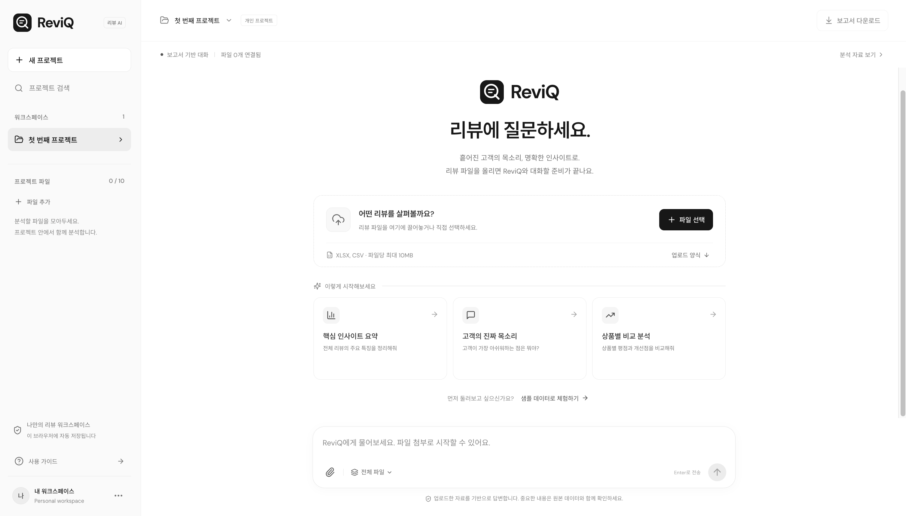
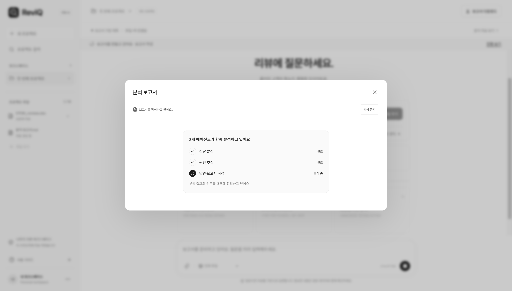
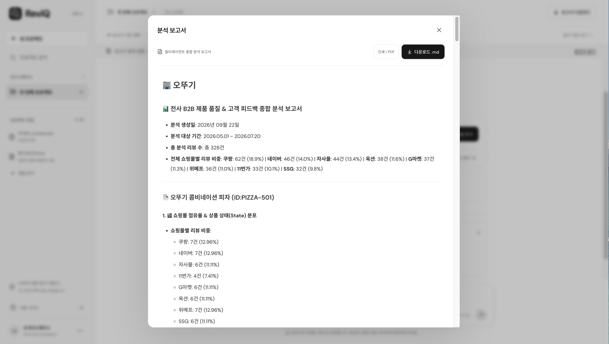
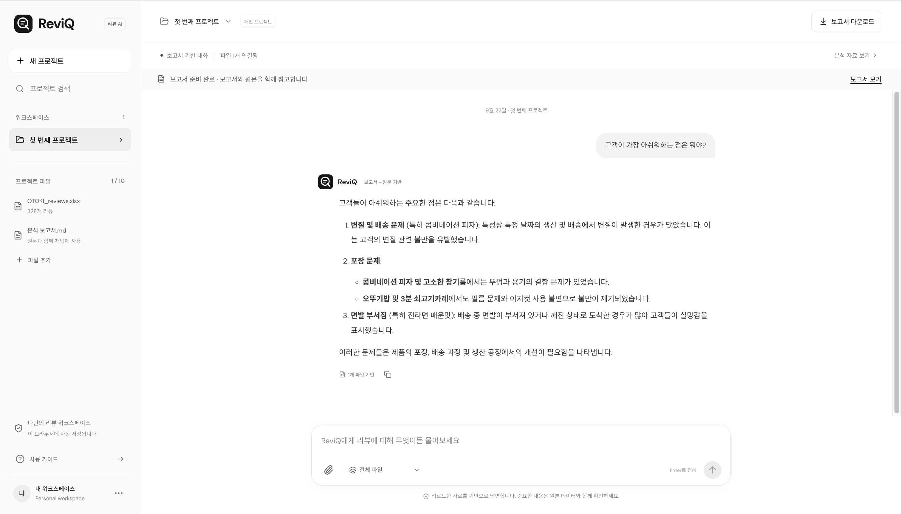
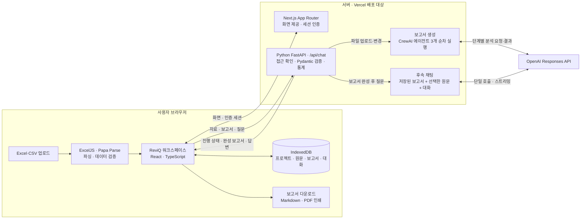
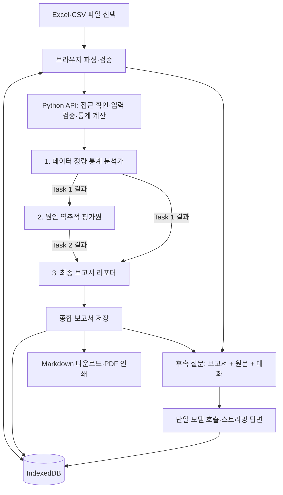

<p align="center">
  
</p>

<h1 align="center">ReviQ</h1>

<p align="center">
  <strong>[멀티에이전트 AI] 리뷰 데이터 기반 분석·채팅·보고서 자동화 서비스</strong><br />
  흩어진 고객의 목소리를 모아, 실행 가능한 인사이트로 연결합니다.
</p>

<p align="center">
  <a href="#서비스-화면">서비스 화면</a> ·
  <a href="#주요-기능">주요 기능</a> ·
  <a href="#시스템-아키텍처">시스템 아키텍처</a> ·
  <a href="#예시-파일">예시 파일</a> ·
  <a href="#시작하기">시작하기</a> ·
  <a href="#vercel-배포">Vercel 배포</a>
</p>

## 프로젝트 소개

**ReviQ**는 제조·유통 기업이 보유한 고객 리뷰를 분석해 품질 이슈와 개선 방향을 파악하도록 돕는 B2B AI 서비스입니다. 여러 쇼핑몰의 Excel·CSV 파일을 프로젝트에 모으고, 데이터에 대해 질문하거나 종합 분석 보고서를 생성할 수 있습니다.

리뷰 건수와 별점 분포, 상품·채널·일자별 통계는 코드로 계산합니다. AI는 계산된 통계와 리뷰 원문을 함께 읽어 고객 의견을 정리하고, 품질·물류·제품·CS 관점의 후속 조치를 제안합니다.

ReviQ는 서비스 기획부터 프론트엔드, Python 분석 서버, 멀티에이전트 구성까지 직접 설계하고 구현한 **개인 개발 프로젝트**입니다. **정량 분석 → 원인 추적 → 보고서 작성**의 3단계 CrewAI 분석으로 보고서를 생성하고, 이후에는 저장된 보고서와 원문을 함께 참고해 대화합니다.

직접 작성한 `legacy/chat_ai.py`의 에이전트 역할·목표·배경, 작업 지침·기대 출력, 채팅 프롬프트를 `backend/prompts.py`에 축약 없이 반영했습니다. 상품별 상태 분포 표, 긍·부정 Top 3, 날짜 역추적, Churn Risk·손실액 추정, 6개 부서 조치사항을 포함한 상세 보고서 양식을 사용합니다.

## 기획 배경

제조사의 리뷰는 자사몰과 여러 판매 채널에 흩어져 있습니다. 담당자가 수작업으로 검토하면 특정 날짜나 쇼핑몰에 집중되는 불만을 놓치기 쉽고, 부서마다 같은 리뷰를 다르게 해석해 대응이 늦어질 수 있습니다.

ReviQ는 리뷰를 공통 자료로 모으고, **어떤 상품에 어떤 불만이 있는지**, **언제·어느 채널에서 발생했는지**, **무엇을 먼저 확인해야 하는지**를 질문과 보고서로 확인하는 작업 흐름을 제공합니다.

| 활용 부서 | 확인하고 싶은 내용 | 활용 예시 |
| --- | --- | --- |
| 경영진 | 주요 이슈와 대응 우선순위 | 핵심 요약을 바탕으로 추가 조사·개선 안건 검토 |
| QC·제조 | 반복되는 제품·포장 불만과 발생 시점 | 원문과 날짜별 분포를 확인해 품질 점검 대상 선정 |
| 물류·SCM | 채널별 파손·누수·냉동 상태 관련 의견 | 특정 채널이나 기간의 배송·보관 기록 점검 |
| 제품기획·R&D | 맛·식감·양·사용 편의성에 대한 의견 | 제품 사양과 포장 개선 과제 정리 |
| CS | 반복되는 불만과 고객의 표현 | 응대 기준과 추가 확인 항목 마련 |
| 마케팅·이커머스 | 만족 요인과 구매 후 기대 차이 | 상세페이지와 고객 안내 문구 개선 |

기획 단계의 평가 축은 **효율성**(검토·보고서 작성 시간), **완전성**(중요 이슈 누락 여부), **신뢰성**(근거와 결론의 일치도)입니다. 시간 절감률이나 탐지 정확도에 대한 정량 성과는 아직 측정하지 않았습니다.

## 서비스 화면

아래는 실제 ReviQ 웹 화면입니다. 채팅과 보고서 화면은 `OTOKI_reviews.xlsx`의 리뷰 328건을 분석한 사용 예시입니다.

### 1. 프로젝트와 파일 관리

프로젝트별로 분석 자료를 모으고, 여러 리뷰 파일을 추가합니다. 파일이 없다면 가상 샘플 데이터로 업로드 이후의 흐름을 체험할 수 있습니다.



### 2. 멀티에이전트 분석 진행

파일을 업로드하면 3개 에이전트가 순서대로 분석합니다. 정량 분석, 원인 추적, 보고서 작성 단계의 진행 상태를 확인할 수 있고, 진행 중인 생성을 중지할 수도 있습니다.



### 3. 종합 분석 보고서

파일을 올리면 프로젝트 전체 자료의 보고서를 자동으로 만듭니다. 오른쪽 위 **보고서 다운로드** 버튼으로 저장된 보고서를 엽니다. 보고서를 미리 보고 Markdown으로 내려받거나, 인쇄 창에서 PDF로 저장할 수 있습니다.



### 4. 보고서와 원문 기반 AI 채팅

완성된 보고서와 업로드한 리뷰 원문을 함께 참고해 답변합니다. 전체 파일 또는 특정 파일을 선택해 고객 불만, 상품별 차이, 개선 방향을 물어볼 수 있습니다. 질문할 때마다 보고서를 다시 생성하지 않고, 한 번의 모델 호출로 답변을 스트리밍합니다.



## 주요 기능

| 기능 | 현재 제공하는 동작 |
| --- | --- |
| 프로젝트 관리 | 생성·검색·이름 변경·삭제, 프로젝트별 파일과 대화 분리 |
| 다중 파일 업로드 | Excel·CSV 여러 개 업로드, 드래그 앤 드롭, CSV 양식 다운로드 |
| 데이터 검증 | 필수 열, 결측값, 날짜, 별점 범위 검사 및 오류 위치 안내 |
| 전체 데이터 통계 | 리뷰 수·평균 별점·긍정/중립/부정 비율, 상품·쇼핑몰·일자별 집계 |
| 파일 범위 선택 | 전체 파일 통합 질문 또는 특정 파일만 선택해 질문 |
| 보고서 기반 채팅 | 저장된 분석 보고서와 원문을 함께 참조하는 단일 호출·스트리밍 답변 |
| 자동 보고서 생성 | 파일 업로드·변경 시 3개 에이전트가 전체 자료를 분석하고 보고서를 저장 |
| 결과 내보내기 | Markdown 다운로드, 브라우저 인쇄를 통한 PDF 저장 |
| 브라우저 저장 | 프로젝트·파싱된 리뷰·대화·보고서를 IndexedDB에 자동 저장 |
| 샘플 체험 | 2개 파일, 가상 리뷰 48건으로 기본 기능 확인 |

AI 키가 없을 때도 파일 업로드, **데이터 요약 보기**, 통계 보고서 다운로드를 사용할 수 있습니다. 이때는 AI 해석이 아닌 **통계 미리보기**로 표시합니다.

### 질문 예시

- “제품 중 문제가 생긴 게 있어?”
- “상품별 평점과 부정 리뷰 비율을 비교해줘.”
- “포장 관련 불만이 어느 쇼핑몰과 날짜에 집중됐어?”
- “고객들이 만족한 점과 아쉬워한 점을 원문 근거와 함께 정리해줘.”
- “QC팀과 물류팀이 먼저 확인할 항목을 나눠서 알려줘.”

## 시스템 아키텍처

### 전체 구성

브라우저에서 리뷰 파일을 파싱하고 프로젝트·대화·보고서를 IndexedDB에 저장합니다. Next.js는 워크스페이스 UI와 비밀번호 인증을 담당하고, Python FastAPI는 입력 검증·통계 계산·AI 실행을 담당합니다. OpenAI API 키는 서버에서만 사용합니다.



로컬에서는 `npm run dev`가 Next.js와 Python 서버를 함께 실행하며, Next.js가 `/api/chat` 요청을 Python으로 프록시합니다. Vercel에서는 Next.js와 Python Function으로 실행하도록 구성했습니다. 완성된 보고서는 브라우저에 저장하고, 채팅에서는 해당 보고서를 재사용합니다.

### CrewAI 멀티에이전트 분석

파일을 올리면 **3개의 독립된 CrewAI Agent와 Task**가 `Process.sequential`로 종합 보고서를 만듭니다. `Task.context`로 앞 단계의 결과를 전달합니다. 이후 채팅은 **저장된 보고서 + 선택한 원문 + 대화 기록**을 한 번의 모델 호출에 전달하며, 멀티에이전트 분석을 반복하지 않습니다.



| 에이전트 | 역할 | 입력 |
| --- | --- | --- |
| 데이터 정량 통계 분석가 | 상품·쇼핑몰·일자별 통계, 식품 속성별 상태 표, 긍·부정 Top 3 집계 | 전체 원문, 회사·기간·리뷰 수·쇼핑몰 비중 메타 정보 |
| 원인 역추적 평가원 | 날짜 역산, 물류·공장 원인 구분, Churn Risk·손실액 추정 | Task 1 결과 |
| 전사 B2B 최종 보고서 리포터 | 상품별 5개 상세 절과 6개 부서별 조치사항을 포함한 종합 보고서 작성 | 전사 메타 정보 + Task 1·2 결과 |

구현은 [backend/analysis.py](backend/analysis.py), 원본은 [legacy/chat_ai.py](legacy/chat_ai.py)에 있습니다. 각 에이전트가 OpenAI Responses API를 사용하며, 모델은 `OPENAI_MODEL`로 공통 설정합니다. 원본의 세 역할을 보고서 생성에 유지하고, 후속 채팅은 [backend/chat.py](backend/chat.py)에서 처리합니다.

전체 파일 질문은 전체 자료를, 단일 파일 질문은 해당 자료만 사용합니다. 대화에는 **같은 보고서 버전·파일 구성에서 작성된 최근 최대 20개 메시지**를 포함합니다. 프로젝트 전체 보고서를 참고 자료로 전달하되, 파일 하나를 선택하면 답변의 사실·수치는 해당 파일의 원문과 통계로 확인하도록 지시합니다. 보고서는 채팅의 파일 선택과 관계없이 프로젝트 전체 파일로 생성합니다. 허용 한도 내의 원문은 모두 전달하며 자동으로 행을 잘라내지 않습니다.

채팅 요청에서는 보고서 전문을 한 번만 전송합니다. 원문은 파일·시트·회사·상품 정보를 그룹별로 묶고 날짜·쇼핑몰은 참조표를 사용해 반복을 줄입니다. 별점·리뷰 내용·원본 행 번호를 포함한 모든 행을 유지하며, 원본 채팅 프롬프트의 4,000자 이후 자료도 별도로 이어서 전달합니다. 스트리밍 중 발생하는 API 오류도 오류 코드로 구분하여 잔액 부족·일시적 제한·요청 크기 초과를 각각 안내합니다.

보고서 생성 중에는 **정량 분석 → 원인 추적 → 답변·보고서 작성** 진행 상태를 표시합니다. 보고서가 완성되면 채팅이 활성화되고, 이후 답변은 스트리밍으로 표시합니다. 보고서 생성 실패·취소·270초 시간 초과 또는 모델의 미완성 응답은 저장하지 않으며, 자동으로 반복 재시도하지 않습니다. 사용자가 보고서 생성 버튼으로 다시 시도할 수 있습니다.

보고서를 처음 만들거나 파일을 변경할 때 통상 3번의 모델 호출을 수행합니다. 이후 질문은 1번의 호출로 답하므로 매 질문마다 3단계 분석을 반복할 때보다 호출 수가 줄어듭니다. 실제 응답 시간은 자료량·모델·네트워크에 따라 달라집니다. 새로고침 후에도 완성된 보고서를 재사용하고, 원문 해시가 보고서의 자료 정보와 다르면 채팅 요청을 거절해 갱신하도록 합니다. 생성 중지는 진행 중인 작업을 취소하지만 이미 처리된 모델 사용량은 과금될 수 있습니다.

화면의 기본 통계와 보고서 메타 정보는 코드로 계산합니다. 보고서는 원본 프롬프트에 따라 생산일 역산·Churn Risk·손실액 추정을 요청하며, 이 추정치는 실제 운영 데이터로 검증된 값이 아닙니다. 외부 조회 도구, Self-Consistency 교차 평가, 배치 처리, 장기 메모리는 구현하지 않았습니다.

## 분석 기준과 데이터

### 입력 형식

지원 형식은 **`.xlsx`**, **`.csv`**입니다. CSV는 UTF-8과 EUC-KR을 지원하며, 구형 `.xls`는 `.xlsx`로 변환해야 합니다. PDF·Word는 현재 앱의 리뷰 분석 입력 형식에 포함되지 않습니다.

첫 행에 아래 8개 열이 있어야 하고, 각 행의 필수 값은 모두 채워야 합니다.

| 열 이름 | 설명 | 예시 |
| --- | --- | --- |
| `카테고리` | 상품 분류 | 라면/면류 |
| `상품` | 실제 상품 이름 | 진라면 매운맛 (5입) |
| `상품ID` | 상품 식별자 | RAMEN-001 |
| `날짜` | 리뷰 작성일 | 2026-05-07 |
| `회사` | 제조·판매 회사 | 오뚜기 |
| `쇼핑몰` | 리뷰가 작성된 채널 | 쿠팡 |
| `별점` | 1~5 정수 | 1 |
| `리뷰 원문` | 고객이 작성한 내용 | 배송 중 면발이 부서졌어요. |

**상품 이름 열은 `상품`으로 입력해야 합니다.** 업로드 전 열 이름을 맞춰주세요. XLSX는 데이터가 있는 모든 시트를 읽으며, 각 시트에 같은 필수 열이 있어야 합니다.

### 처리 한도

| 항목 | 한도 |
| --- | --- |
| 프로젝트당 파일 | 최대 10개 |
| 파일 크기 | 파일당 10MB |
| 리뷰 행 | 파일당 5,000개 |
| XLSX 열 | 시트당 100열 |
| 리뷰 원문 | 행당 10,000자 |
| 프로젝트 분석 데이터 | 직렬화된 전체 리뷰 기준 160,000자 |
| API 요청 본문 | 2,000,000바이트 |

한도를 초과하면 오류를 안내합니다. 자료를 여러 프로젝트로 나누어 분석할 수 있습니다.

### 통계와 해석 구분

- **긍정**: 별점 4~5점 / **중립**: 3점 / **부정**: 1~2점. 이 분류는 별점 기준이며 텍스트 감성 분석 결과와 동일하지 않을 수 있습니다.
- **중복 처리**: 같은 리뷰가 여러 파일에 있으면 각각의 행으로 집계합니다.
- **AI 근거**: 원본 프롬프트의 데이터 기반 분석 지침을 사용하고 입력 자료에 파일·시트·행 출처를 포함합니다. 실제 출력에서 출처가 빠지거나 잘못 연결될 수 있어 원문 확인이 필요합니다.
- **원인 가설**: 리뷰의 날짜·채널 패턴은 점검 방향을 제안하는 근거입니다. 실제 생산일, 물류·공장 결함, 이탈 확률, 손실액을 확정하려면 별도 운영 데이터가 필요합니다.

### 예시 파일

아래 Excel 파일을 내려받아 ReviQ의 **파일 선택**으로 업로드하면 보고서 생성과 후속 채팅을 체험할 수 있습니다. 서비스 화면에는 `OTOKI_reviews.xlsx`를 사용했습니다. 두 파일은 제공된 원본을 수정 없이 포함했습니다.

| 데이터 파일 | 리뷰 수 | 상품 수 | 쇼핑몰 수 |
| --- | ---: | ---: | ---: |
| [OTOKI_reviews.xlsx 다운로드](examples/OTOKI_reviews.xlsx) | 328 | 5 | 8 |
| [cj_reviews.xlsx 다운로드](examples/cj_reviews.xlsx) | 326 | 5 | 8 |

화면에서는 포장 개봉 불편, 파손, 누수, 배송 상태 등에 대한 고객 의견을 분석하는 흐름을 확인할 수 있습니다. AI의 원인·위험도·손실액 추정은 실제 운영 자료와 대조해 검토해야 합니다.

## 기술 스택

| 영역 | 기술 | 용도 |
| --- | --- | --- |
| 프론트엔드 | Next.js 16 App Router, React 19, TypeScript | 프로젝트 UI, 채팅, 보고서 미리보기 |
| 디자인 | CSS, Lucide React, ReviQ SVG 심볼 | 흰색·흑백 UI, 반응형 레이아웃 |
| 파일 처리 | ExcelJS, Papa Parse | XLSX·CSV 파싱 |
| 데이터 검증 | Pydantic, Python, TypeScript | 서버 입력 검증·통계 계산, 브라우저 통계 미리보기 |
| AI 백엔드 | Python 3.12, FastAPI, CrewAI, OpenAI Responses API | 3개 에이전트의 순차 분석·결과 전달 |
| 브라우저 저장 | IndexedDB, idb-keyval | 프로젝트와 대화 영속 저장 |
| 문서 표시 | react-markdown, remark-gfm | Markdown·표 렌더링 |
| 검증 | pytest, Node.js Test Runner, tsx, Playwright | 에이전트 실행·API·데이터·브라우저 테스트 |
| 배포 대상 | Vercel | Next.js UI·인증 API + Python 분석 Function |

## 시작하기

Node.js 22 이상, npm, [uv](https://docs.astral.sh/uv/getting-started/installation/)가 필요합니다. `uv sync`가 Python 3.12와 고정된 Python 의존성을 설치합니다.

```bash
npm install
uv sync
cp .env.example .env.local
```

`.env.local`에 환경 변수를 설정합니다.

```dotenv
OPENAI_API_KEY=your_openai_api_key
OPENAI_MODEL=gpt-4o
APP_PASSWORD=your_long_workspace_password
```

| 환경 변수 | 용도 | 필수 여부 |
| --- | --- | --- |
| `OPENAI_API_KEY` | 서버에서 사용하는 OpenAI API 키 | AI 채팅·AI 보고서 사용 시 필요 |
| `OPENAI_MODEL` | 세 에이전트가 사용할 OpenAI 모델 | 선택, 기본값 `gpt-4o` |
| `APP_PASSWORD` | 워크스페이스 AI 접근 비밀번호 | 로컬 선택, Vercel 필수 |

환경 변수를 저장한 뒤 개발 서버를 실행합니다. 한 명령으로 Python 분석 서버(8000)와 Next.js(3000)를 함께 실행하며 `.env.local`을 공유합니다. 종료 시 두 프로세스가 함께 종료됩니다.

```bash
npm run dev
```

[http://localhost:3000](http://localhost:3000)에 접속해 **프로젝트 생성 → 파일 추가 → 질문 → 보고서 다운로드** 순서로 사용합니다. 데이터가 없다면 **샘플 데이터로 체험하기**를 선택하세요.

키는 서버에서만 사용하며 `NEXT_PUBLIC_` 접두사를 붙이지 않습니다. `.env.example`은 공유용 양식이므로 실제 키를 입력하지 마세요. 로컬 `npm run dev` / `npm start`는 프로젝트 환경 파일의 `OPENAI_API_KEY`, `OPENAI_MODEL`, `OPENAI_BASE_URL`, `APP_PASSWORD`를 셸에서 상속된 값보다 우선 사용합니다. 파일 우선순위는 `.env.<development 또는 production>.local` → `.env.local` → `.env.<development 또는 production>` → `.env`이며, 해당 설정이 파일에 없으면 셸 환경변수를 사용합니다. Vercel은 배포 환경변수 설정을 사용합니다.

기존 Next.js 단독 서버가 켜져 있다면 `Ctrl+C`로 종료하고 `npm run dev`로 다시 실행해야 Python 백엔드도 시작됩니다. 포트 충돌 시 기존 프로세스를 자동 종료하지 않습니다. 필요한 경우 `PORT=3001 REVIQ_API_PORT=8001 npm run dev`로 변경하세요. 로컬 운영 모드는 `npm run build` 후 `npm start`입니다.

## Vercel 배포

1. 코드와 `docs/screenshots/`를 포함해 GitHub 저장소에 올립니다.
2. Vercel에서 **Add New → Project**로 저장소를 Import합니다.
3. Framework Preset은 **Next.js**, Root Directory는 저장소 루트, Build Command는 `npm run build`로 설정합니다.
4. 사용할 환경에 `OPENAI_API_KEY`, `OPENAI_MODEL`, `APP_PASSWORD`를 등록합니다.
5. Fluid compute를 활성화하고 Python Function의 최대 실행 시간을 300초로 설정합니다. 저장소의 `vercel.json`에도 300초를 지정했습니다.
6. Deploy한 뒤 파일 업로드·비밀번호 입력·채팅·보고서 다운로드를 확인합니다. 환경 변수를 변경했다면 Redeploy합니다.

`api/chat.py`는 `/api/chat`의 Python Function으로, `app/api/session/route.ts`는 Next.js 인증 API로 배포됩니다. `pyproject.toml`·`uv.lock`·`.python-version`을 함께 커밋해야 합니다. 로컬 Next.js는 분석 요청만 Python으로 프록시합니다.

CrewAI는 벡터 DB 등 큰 의존성을 포함합니다. Python 번들이 기본 500MB 한도를 넘는 환경에서는 Vercel의 Large Functions(Fluid compute, 베타) 설정이 필요할 수 있습니다. 실제 배포의 빌드 로그에서 번들 크기와 제공 플랜을 확인하세요. 이 저장소 변경만으로 배포 성공을 보증하지 않습니다. [Vercel Python 런타임](https://vercel.com/docs/functions/runtimes/python), [Python `/api` 라우팅](https://vercel.com/docs/functions/runtimes/python/api-directory)을 참고하세요.

현재 구현은 Vercel 환경에서 `APP_PASSWORD`가 없으면 AI 요청을 차단합니다. 이 비밀번호는 AI API 접근 보호용이며 사용자별 회원 계정이나 팀 권한 시스템은 아닙니다. 화면 자체는 공개되고, 자료는 각 브라우저에 저장됩니다.

## 저장과 개인정보 처리

프로젝트·파싱된 리뷰·대화·보고서는 **현재 브라우저의 IndexedDB**에 저장됩니다. 브라우저 데이터를 삭제하면 사라지며, 다른 기기나 브라우저와 자동 동기화되지 않습니다. 원본 파일의 바이너리는 별도로 보관하지 않습니다.

AI 연결·로그인 상태에서 파일을 올리면 전체 리뷰가 보고서 생성을 위해 Python 서버와 OpenAI에 전송됩니다. 이후 채팅에는 저장된 보고서·선택한 리뷰·필요한 대화 기록이 전달됩니다. `store: false`를 사용하지만, 이것이 API 제공자의 모든 데이터 보존 정책을 없애는 의미는 아닙니다. CrewAI 추적·텔레메트리와 장기 메모리는 비활성화하며, Task 결과는 요청별 메모리 저장소에만 보관합니다. 키나 원본 데이터를 애플리케이션 로그에 출력하지 않습니다.

파일을 추가·삭제하면 기존 보고서를 무효화하고 남아 있는 전체 파일로 보고서를 다시 만듭니다. 이전 축약 프롬프트로 생성했거나 자료 확인 정보가 없는 보고서는 프로젝트를 열 때 한 번 다시 생성합니다. 과거 대화는 그대로 보관하며 새로운 보고서의 대화 문맥에서는 제외합니다. 과거 채팅은 당시 자료에 대한 기록으로 남습니다. 기존 사용자의 자료를 유지하기 위해 내부 저장소 키는 `review-studio-v1`을 사용합니다.

## 프로젝트 구조

```text
app/
  api/session/route.ts    # 설정 상태와 비밀번호 인증
  layout.tsx             # ReviQ 메타데이터와 스타일
  page.tsx               # 워크스페이스 진입점
  globals.css            # 기본 레이아웃
  reviq.css              # ReviQ 디자인
components/
  workspace.tsx          # 프로젝트·파일·채팅·보고서 UI
  reviq-mark.tsx          # 전용 로고 컴포넌트
lib/
  analysis.ts            # 통계와 통계 보고서
  parse.ts               # Excel·CSV 파싱과 검증
  auth.ts                # 접근 확인과 세션 서명
  sample.ts              # 가상 샘플과 CSV 양식
  types.ts               # 데이터 타입과 처리 한도
api/chat.py             # Python 분석 API: 인증·검증·진행 이벤트
backend/
  analysis.py            # 보고서용 3개 CrewAI Agent·Task
  prompts.py             # 원본 Python의 에이전트·보고서·채팅 프롬프트 전문
  chat.py                # 저장된 보고서와 원문 기반 스트리밍 채팅
  llm.py                 # 완료 상태를 검증하는 OpenAI 어댑터
  models.py              # 입력 모델·서버 통계 계산
scripts/dev.mjs          # 로컬 Python + Next.js 동시 실행
pyproject.toml / uv.lock # Python 의존성과 버전 고정
vercel.json             # Python Function 실행 시간·번들 설정
docs/screenshots/        # README 서비스 화면 4장
examples/                # OTOKI·CJ 리뷰 Excel 예시 파일 2개
public/brand/            # ReviQ SVG·PNG 아이콘
legacy/chat_ai.py        # 직접 작성한 Python 분석 원본
tests/                  # 데이터·API·브라우저 테스트
```

## 검증

```bash
npm run test
npm run test:agents
npm run typecheck
npm run build
```

개발 서버가 실행 중인 상태에서 브라우저 테스트를 수행합니다.

```bash
npx playwright test
```

테스트는 파일 파싱·통계 집계·API 입력 검증·프로젝트 저장 복원·파일 범위 선택·보고서 다운로드·스트리밍 중단 처리를 확인합니다. 실제 CrewAI를 실행하여 3단계 순서·Task 문맥 전달·동시 요청 분리·실패 시 중단·시간 초과·취소를 검증합니다. 모델 전송만 모의 응답으로 대체하며, 실제 모델의 분석 품질이나 원인 추정 정확도를 측정하는 평가는 아닙니다. macOS 테스트 설정은 설치된 Google Chrome을 사용합니다.

## 향후 확장

- 사용자별 로그인, 클라우드 저장소, 기기 간 동기화와 팀 공유
- 대용량 리뷰의 배치 처리, 누적 요약, 검색 기반 자료 참조
- 운영·물류·생산 데이터 조회 도구와 연결하는 에이전트 확장
- 여러 관점의 평가를 교차 검증하는 Self-Consistency 적용
- 회사별 비교 화면과 기간별 이슈 추이 시각화
- 실제 CRM·매출 데이터로 검증하는 위험도·손실 추정 모델
- 검토 시간, 이슈 누락률, 출처 정확도를 측정하는 평가 데이터셋

## 브랜드

**ReviQ** 아이콘은 질문을 뜻하는 **Q** 안에 리뷰 문서의 두 줄을 담고, 꼬리로 대화를 표현합니다. [SVG 아이콘](public/brand/reviq-icon.svg)과 [512px PNG 아이콘](public/brand/reviq-icon.png)을 제공합니다.
